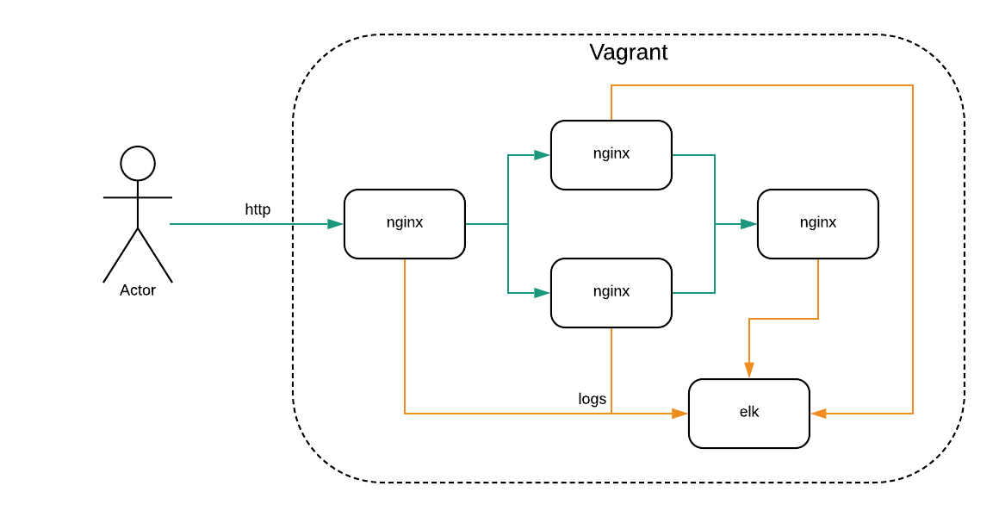

# lb
devops-test



## Настрока среды виртуализации
- Установка centos 7
- Установка ansible
```bash
yum install epel-release
yum install ansible
ansible --version
"ansible 2.9.10"
```
## Установка vagrant и Libvirt

```bash
yum group install -y "Development Tools"
yum -y install qemu-kvm libvirt virt-install bridge-utils libvirt-devel  libxslt-devel libxml2-devel libvirt-devel libguestfs-tools-c
echo "net.ipv4.ip_forward = 1"|sudo tee /etc/sysctl.d/99-ipforward.conf
sysctl -p /etc/sysctl.d/99-ipforward.conf
systemctl enable libvirtd
systemctl start libvirtd
wget https://releases.hashicorp.com/vagrant/2.2.9/vagrant_2.2.9_x86_64.rpm
rpm -i vagrant_2.2.9_x86_64.rpm
vagrant plugin install vagrant-libvirt
```

## Проверка что все установилось коректно

```bash
vagrant plugin list
"vagrant-libvirt (0.1.2, global)"

virsh --version
"4.5.0"

virsh nodeinfo

dmesg | grep kvm
```

